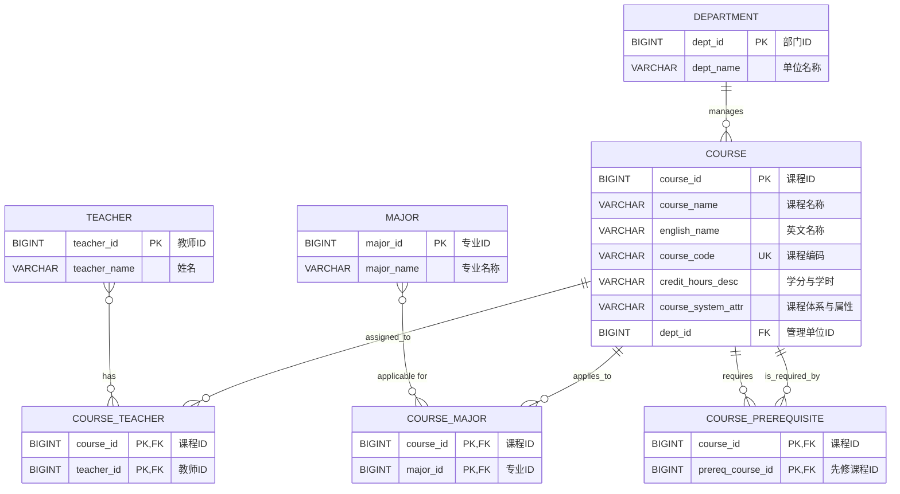

```mermaid
erDiagram
    DEPARTMENT ||--o{ COURSE : manages
    DEPARTMENT {
        BIGINT dept_id PK "部门ID"
        VARCHAR dept_name "单位名称"
    }

    TEACHER }o--o{ COURSE_TEACHER : "has"
    TEACHER {
        BIGINT teacher_id PK "教师ID"
        VARCHAR teacher_name "姓名"
    }

    MAJOR }o--o{ COURSE_MAJOR : "applicable for"
    MAJOR {
        BIGINT major_id PK "专业ID"
        VARCHAR major_name "专业名称"
    }

    COURSE {
        BIGINT course_id PK "课程ID"
        VARCHAR course_name "课程名称"
        VARCHAR english_name "英文名称"
        VARCHAR course_code UK "课程编码"
        VARCHAR credit_hours_desc "学分与学时"
        VARCHAR course_system_attr "课程体系与属性"
        BIGINT dept_id FK "管理单位ID"
    }

    COURSE_TEACHER {
        BIGINT course_id PK, FK "课程ID"
        BIGINT teacher_id PK, FK "教师ID"
    }

    COURSE_MAJOR {
        BIGINT course_id PK, FK "课程ID"
        BIGINT major_id PK, FK "专业ID"
    }

    COURSE_PREREQUISITE {
        BIGINT course_id PK, FK "课程ID"
        BIGINT prereq_course_id PK, FK "先修课程ID"
    }

    COURSE ||--o{ COURSE_TEACHER : assigned_to
    COURSE ||--o{ COURSE_MAJOR : applies_to
    COURSE ||--o{ COURSE_PREREQUISITE : requires
    COURSE ||--o{ COURSE_PREREQUISITE : is_required_by
```
